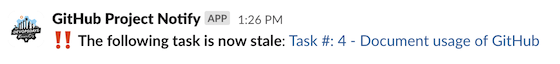

import Highlight from '@site/src/components/Highlight';

Below are the automations that are put in place to help the team get work done more efficiently.

* <Highlight color="black">[GitHub Action]</Highlight> **Stale issues and Slack notify**: This action will automatically label any task that has been stale for >30d with <Highlight color="#C3186D">stale-issue</Highlight>, and then notify the `_external_feed` Slack channel.

