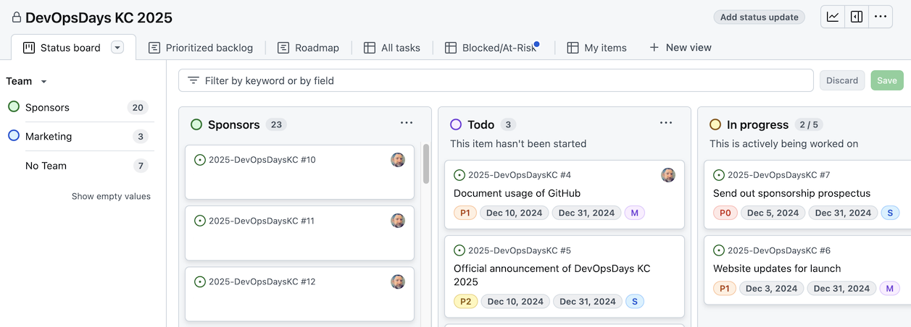

The default view for the project is the **Status board**.

### Status board

The board is broken down into columns, each representing a different status of the tasks. Tasks can be moved between columns by either dragging and dropping, or selecting the `&hellip;` (More Actions) next to the task title and selecting `↔️ Move to column`.

The columns are:

* **Sponsors:** where we track tasks related to sponsors. This is placed first to keep them visible and separate from the rest of the tasks, and to make sure we are keeping them top of mind.
* **Todo:** where tasks that need to be done are placed
* **In Progress:** where tasks that are being worked on are placed
* **Review:** where tasks that are ready for review are placed, to be discussed at the weekly meeting
* **Done:** where tasks that have been completed are placed
