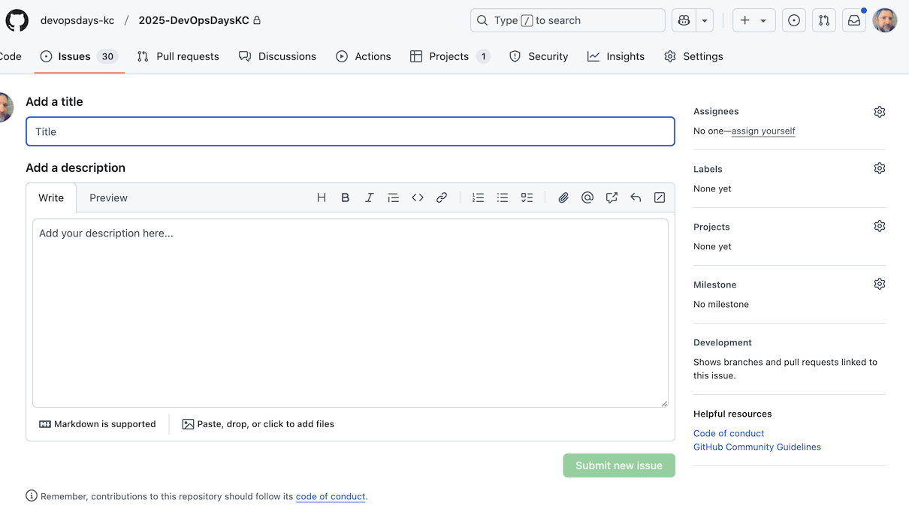
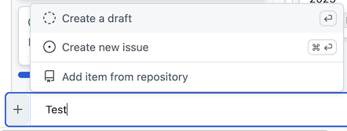
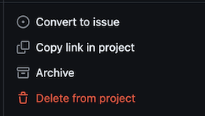

import Highlight from '@site/src/components/Highlight';

## Creating a task

A task can be created a couple of ways:

Go to the DevOpsDays KC 2025 repo and either click on **Issues** and select **New issue**...

...or click on **Projects** and select **Add item** for the column you want to add the task to.

:::tip

On the project board, "Status board" should be the default view. If you are not seeing the project board, click on the **Projects** tab at the top of the repo.

:::

Hitting Enter will the task as a draft, for you to enter the details later, or choose **Create new issue** (or Command + Enter) to create the new task immediately.

One you have created the task, you will need to fill out the details.

:::info

If you save the task as a draft, you will need to go into it and fill out the details, and then `Convert to issue` before it can be worked on

:::

Recommended minimum fields:

* **Title**, i.e. *`Send welcome email to speakers`*
* **Description**, i.e. *`Send the email to all accepted speakers welcoming them to the event and providing them with the next steps`*
* **Labels**, i.e. classify the work to be done, if known, e.g. <Highlight color="#7057ff">process</Highlight>. See **[Labeling tasks](#labeling-tasks)** section for more information.
* **Project**, i.e. *`DevOpsDays KC 2025`*
  * **Status**, i.e. *`To do`* (Note: by default you should choose *`To do`* as the status, unless it is a Sponsor task, in which case you should choose *Sponsors* which helps us keep them visible and separate)
  * **Team**, i.e. *`Sponsors`* (Note: this is the Squad that the task belongs to)
  * **Priority**, unless this is a High-Priority (P0), leave this blank and we can set it later
  * **Size**, i.e. *`S`* (Note: this is the size of the task in reference to t-shirt sizes, and should be set by the person who will be working on the task - if you are unsure, leave it blank and we can set it later)

The rest of the fields can be entered later.

### Labeling tasks

Labeling tasks helps to keep them organized and easy to find, and you can add multiple labels to a task. The following labels are available:

* <Highlight color="#35F24B">sponsors</Highlight> - tasks related to sponsors
* <Highlight color="#6D4488">speakers</Highlight> - tasks related to speakers
* <Highlight color="#e4e669">at-risk</Highlight> - tasks that are at risk of not being completed on time
* <Highlight color="#d73a4a">blocked</Highlight> - tasks that are blocked and cannot be completed
* <Highlight color="#7057ff">process</Highlight> - tasks related to process improvements
* <Highlight color="#d876e3">question</Highlight> - tasks that need a question answered before work can be continued or completed
* <Highlight color="#25C710">ready-for-review</Highlight> - tasks ready to be reviewed by the Team, usually at a weekly meeting
* <Highlight color="#a2eeef">social-media</Highlight> - tasks related to social media
* <Highlight color="#0075ca">volunteers</Highlight> - tasks related to volunteers
* <Highlight color="#fbca04">website</Highlight> - tasks related to work being done on the website

## Working with tasks

### Beginning work on a task

Once a task has been created, it usually will begin with a status of **Todo**. Once work begins on that tasks, it will be moved to **In Progress**. The following fields should be updated once a task is in progress:

* Assignees
* Labels
* Projects:
  * Team
  * Priority
  * Size
  * Start date (when work began)
  * End date (when work is expected to be completed)

The tasks should be regularly updated with progress, and if there are any blockers, those should be noted in the task, and then the task should have the <Highlight color="#d73a4a">blocked</Highlight> label added. If a task is blocked, it should be moved back to **Todo** and the blocker should be noted in the task.

You can mention other team members in the task by using the `@` symbol and typing their GitHub username. This will notify them that they have been mentioned in the task.
