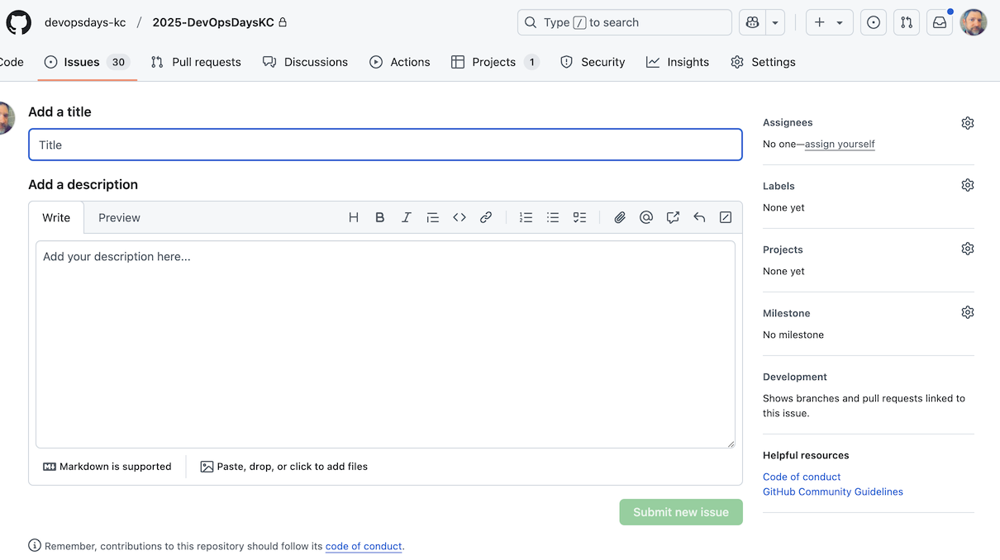
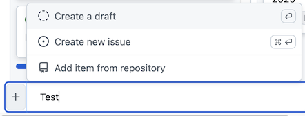
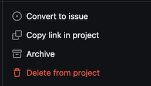

import Highlight from '@site/src/components/Highlight';

For tasks, starting with DevOpsDays KC 2025, we will be using GitHub Projects. This will be a new process for the team, after years of using Trello, so we will be learning as we go. The main goal is to have a single source of truth for tasks and to make sure we are all on the same page.

Everything that we need to do will be tracked in GitHub Projects. This will include tasks, issues, and other items that need to be done. When a task is created, it will be assigned to a Squad, and then the Squad will assign it to a person. The person will then move the task through the project board as they work on it, getting feedback from the Squad and/or the rest of the Organizing Team as needed.

:::info

**Prerequisites**

* GitHub account
* Access to the [DevOpsDays KC GitHub](https://github.com/devopsdays-kc) organization
* Access to the DevOpsDays KC 2025 Repo and Project

:::

## Create a task

A task can be created a couple of ways:

1. Go to the DevOpsDays KC 2025 repo and either click on **Issues** and select **New issue**...

1. On the project board select **Add item** for whichever status column you want to add the task to.

:::tip

On the project board, "Status board" should be the default view. If you are not seeing the project board, click on the **Projects** tab at the top of the repo.

:::

Hitting Enter will the task as a draft, for you to enter the details later, or choose **Create new issue** (or Command + Enter) to create the new task immediately.

One you have created the task, you will need to fill out the details.

:::info

If you save the task as a draft, you will need to go into it and fill out the details, and then `Convert to issue` before it can be worked on

:::

Recommended minimum fields:

* **Title**, i.e. *`Send welcome email to speakers`*
* **Description**, i.e. *`Send the email to all accepted speakers welcoming them to the event and providing them with the next steps`*
* **Labels**, i.e. classify the work to be done, if known, e.g. <Highlight color="#7057ff">process</Highlight>
* **Project**, i.e. *`DevOpsDays KC 2025`*
  * **Status**, i.e. *`To do`* (Note: by default you should choose *`To do`* as the status, unless it is a Sponsor task, in which case you should choose *Sponsors* which helps us keep them visible and separate)
  * **Team**, i.e. *`Sponsors`* (Note: this is the Squad that the task belongs to)
  * **Priority**, unless this is a High-Priority (P0), leave this blank and we can set it later
  * **Size**, i.e. *`S`* (Note: this is the size of the task in reference to t-shirt sizes, and should be set by the person who will be working on the task - if you are unsure, leave it blank and we can set it later)

The rest of the fields can be entered later.

## Working with tasks

### Beginning work on a task

Once a task has been created, it usually will begin with a status of **Todo**. Once work begins on that tasks, it will be moved to **In Progress**. The following fields should be updated once a task is in progress:

* Assignees
* Labels
* Projects:
  * Team
  * Priority
  * Size
  * Start date (when work began)
  * End date (when work is expected to be completed)

The tasks should be regularly updated with progress, and if there are any blockers, those should be noted in the task, and then the task should have the <Highlight color="#d73a4a">blocked</Highlight> label added. If a task is blocked, it should be moved back to **Todo** and the blocker should be noted in the task.

### Labeling tasks

Labeling tasks helps to keep them organized and easy to find. The following labels are available:

* <Highlight color="#35F24B">sponsors</Highlight> - tasks related to sponsors
* <Highlight color="#6D4488">speakers</Highlight> - tasks related to speakers
* <Highlight color="#e4e669">at-risk</Highlight> - tasks that are at risk of not being completed on time
* <Highlight color="#d73a4a">blocked</Highlight> - tasks that are blocked and cannot be completed
* <Highlight color="#7057ff">process</Highlight> - tasks related to process improvements
* <Highlight color="#d876e3">question</Highlight> - tasks that need a question answered before work can be continued or completed
* <Highlight color="#25C710">ready-for-review</Highlight> - tasks ready to be reviewed by the Team, usually at a weekly meeting
* <Highlight color="#a2eeef">social-media</Highlight> - tasks related to social media
* <Highlight color="#0075ca">volunteers</Highlight> - tasks related to volunteers
* <Highlight color="#fbca04">website</Highlight> - tasks related to work being done on the website

